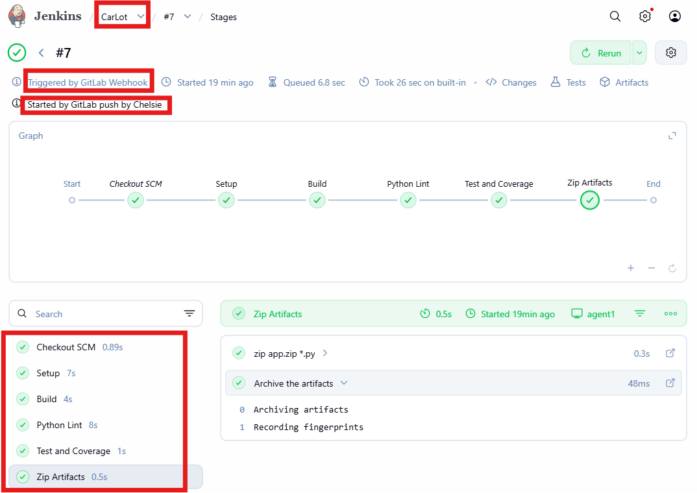
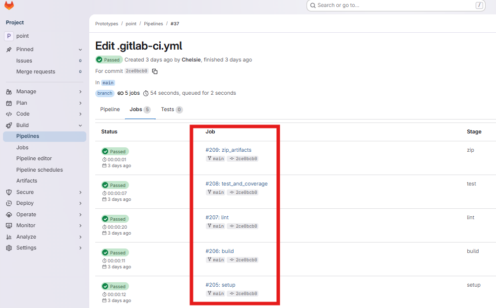

# ci-pipelines

This repository showcases the **CI/CD pipelines** I implemented using **Jenkins** and **GitLab CI** for Python projects.  
I built these pipelines to automate testing, code reuse, and continuous integration.
---

## Repository Structure

```
CI-Pipelines/
├─ GitLab CI/
│  ├─ ci/
│  │  └─ Jenkinsfile
│  ├─ .gitlab-ci.yml
│  ├─ base.py
│  ├─ create_tables.py
│  ├─ drop_tables.py
│  ├─ point_manager.py
│  ├─ point.py
│  ├─ points_api.py
│  ├─ requirements.txt
│  ├─ test_point_manager.py
│  └─ test_points_api.py
├─ Jenkins/
│  ├─ carLot/
│  ├─    ├─  ci/
│  ├─    ├─     └─ Jenkinsfile
│  └─ ci_functions/
│      └─ vars/
│          └─ python_build.groovy
├─ screenshots/
└─ README.md
```

## Jenkins Pipeline

### What I Did
I created a Jenkins pipeline to automate testing of my Python modules.

* **Shared Library**: I created a shared library at `Jenkins/ci_functions/vars/python_build.groovy` to store reusable functions. This allowed me to follow the DRY principle.
* **Reference**: I referenced the shared library in my `Jenkinsfile` located at `Jenkins/carLot/ci/Jenkinsfile`.
* **Automation**: I configured triggers and a webhook for automatic builds.
---


### File References
| File | Purpose |
| :--- | :--- |
| `Jenkins/ci_functions/vars/python_build.groovy` | Shared library with reusable pipeline functions |
| `Jenkins/CarLot/ci/Jenkinsfile` | Main Jenkins pipeline definition |


---

## GitLab CI Pipeline

### What I Did
For GitLab CI, I focused on automating testing and code management for the point module.

* **Configuration**: I created the pipeline file `.gitlab-ci.yml` at `GitLab CI/.gitlab-ci.yml`.
* **Stages**:
    * **Install Dependencies**: Install Python packages from `requirements.txt`.
    * **Run Tests**: Execute unit tests (`test_point_manager.py` and `test_points_api.py`).
    * **Lint/Code Checks**: Code style verification.
* **Integration**: Integrated with my Python project structure inside `GitLab CI/`.
---


### File References
| File | Purpose |
| :--- | :--- |
| `GitLab CI/.gitlab-ci.yml` | Main GitLab CI pipeline definition |
| `GitLab CI/*.py` | All python files (logic, database, testing) |
| `GitLab CI/requirements.txt` | Python dependencies |


